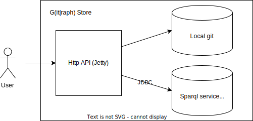

# G(it|raph) Store

A web service for retrieving, validating and storing rdf data (jsonld) in 
1. a SPARQL endpoint using filepath as graph 
2. a git-enabled storage.  

The G is an ORcronym for (git|graph).

You can find the documentation under: https://dbpedia.gitbook.io/databus/v/gstore/

You can find a test instance to try queries on your own under: http://gstore-playground.tools.dbpedia.org/
  
## Overview

